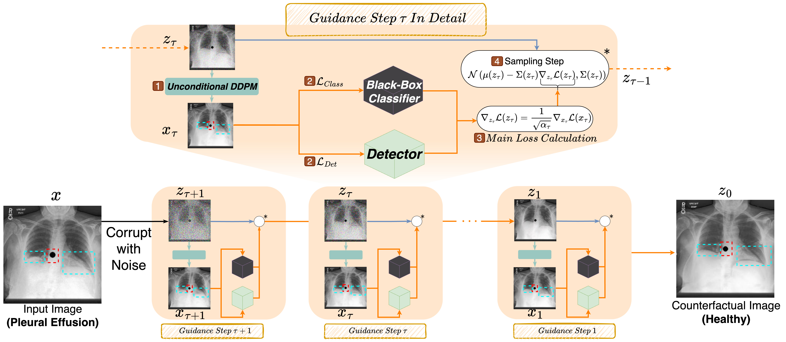
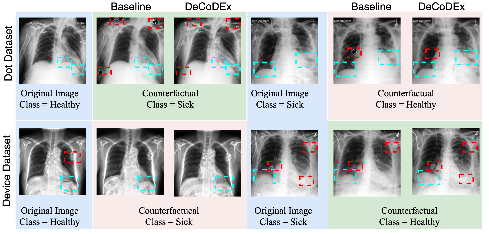
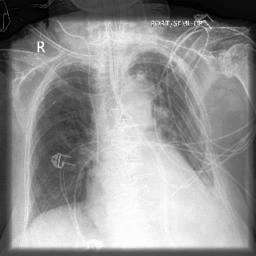

# DeCoDEx: Confounder Detector Guidance for Improved Diffusion-based Counterfactual Explanations

This is the official repository of the DeCoDEx (submitted to Medical Imaging with Deep Learning (MIDL 2024)). 

Link to the paper - [DeCoDEx](https://openreview.net/forum?id=M6CfJ5H7XH)



Some of the qualitative results highlighting the strength of DeCoDEx is shown below:


The gif below shows the changes between factual and counterfactual images



Samples of the synthesized counterfactual images


## Table of Contents
- [Create Virtual Environment](#create-virtual-environment-venv)
- [Create Datasets](#create-datasets)
- [Train DDPM](#train-ddpm)
- [Train Classifiers](#train-classifiers)
- [Counterfactual Generation](#counterfactual-generation)
- [Reference](#code-base)

## Create Virtual Environment Venv
Create a virtual Environment and install the nessecary packages from the `requirements.txt` file as shown:
```bash
pip install -r requirements.txt --no-cache
```

## Create Datasets

Follow the steps outlined below:

1. **Data Preparation**: Download cheXpert dataset from this [link](https://stanfordmlgroup.github.io/competitions/chexpert/). Use the `train.csv` file to contrive different versions of the dataset.
2. **Preprocessing**: Apply the necessary preprocessing steps. We have two different sub-datasets:
- _Dot Dataset_: In this case, we only use the subjects without support devices based on the labels in the `train.csv` file. 90% of the subjects with `Pleural Effusion` are augmented with the artifact whereas only 10% of subjects with `No Finding` contain the artifact. [Dot Dataset](notebooks/create_dot_dataset.ipynb)
- _Device Dataset_: In this case, no modifications are made to the raw images directly downloaded from the repository. For subjects with `Pleural Effusion` we contrive the number of samples in a way that 90% of such subjects also have `Support Devices` whereas for the subjects with `No Finding` statistics are the opposite (90% of such subjects do not have `Support Devices`). [Device Dataset](notebooks/create_md_dataset.ipynb)

## Train DDPM

To train the Denoising Diffusion Probabilistic Model (DDPM) used in our framework, follow the steps below. Adjust the parameters as needed for your specific use case.

```bash
python train_ddpm.py --dataset [YOUR_DATASET] --epochs 50 --learning_rate 1e-4 --batch_size 16 --lr 1e-4 \
                     --save_interval 10000 --weight_decay 0.05 --dropout 0.0 --diffusion_steps 500 \
                     --noise_schedule linear --num_channels 128 --num_head_channels 64 --num_res_blocks 2 
```

Replace `[YOUR_DATASET]` with the path to your dataset and adjust other arguments as necessary.

## Train Classifiers

### Usage

To train your model, use the following command structure. Replace the placeholder values with your specific configurations:

```bash
python [erm.py|groupdro.py] \
  --data_dir [path_to_data] \
  --model_path [path_to_save_model] \
  --epochs [num_epochs] \
  --batch_size [batch_size] \
  --image_size [image_dim] \
  --lr [learning_rate] \
  --lr_sf [lr_scheduler_factor] \
  --lr_patience [lr_scheduler_patience] \
  --task [classification/detection] \
  [additional_arguments]
```

### Arguments Description
`erm.py` for ERM and `groupdro.py` for Group-DRO methods

- `--data_dir`: The directory where your dataset is located.
- `--model_path`: Path where the trained model will be saved.
- `--epochs`: Number of training epochs. Default is 40.
- `--batch_size`: Number of samples per training batch. Default is 32.
- `--image_size`: The height and width of the images in pixels. Default is 256.
- `--lr`: The initial learning rate. Default is 0.0002.
- `--lr_sf`: Factor by which the learning rate is reduced. Default is 0.1.
- `--lr_patience`: Number of epochs with no improvement after which learning rate will be reduced. Default is 5.
- `--task`: Specifies the task for the model, either 'classification' or 'detection'.
- `--random_crop`: Enable random cropping as a data augmentation method (optional).
- `--random_flip`: Enable random horizontal flipping as a data augmentation method (optional).
- `--gpu_id`: The ID of the GPU to use. Default is 0.
- `--biased`: Use this flag if you are working with a biased dataset (optional).
- `--balanced`: Use this flag if you want to use a balanced dataset (default is balanced).
- `--balance_ratio`: The ratio of positive to negative samples in the balanced dataset. Default is 0.1.
- `--augment`: Augment dataset with counterfactually generated samples.
- `--augmented_data_dir`: Path to the directory that contains CF images for augmentation.
- `--dataset`: Choose between 'PE90DotNoSupport' and 'MedicalDevicePEDataset' for the dataset.

## Counterfactual Generation

DeCoDEx generates counterfactual explanations by integrating diffusion models with classifiers and detectors. The generation script is configurable to accommodate various experimental setups and datasets.

### Generating Counterfactuals

```bash
python -W ignore ../mains/main_md_gradreversal.py [MODEL_FLAGS] [SAMPLE_FLAGS] \
  --output_path [your_output_path] \
  --num_batches [number_of_batches] \
  --start_step [starting_diffusion_step] \
  --dataset [your_dataset_name] \
  --exp_name [your_experiment_name] \
  --gpu [gpu_id] \
  --model_path [path_to_ddpm_model] \
  --classifier_scales [classifier_scales] \
  --detector_scales [detector_scales] \
  --classifier_path [path_to_classifier_model] \
  --detector_path [path_to_detector_model] \
  --seed [random_seed] \
  --oracle_path [path_to_oracle_model] \
  --use_logits [use_logits_flag] \
  --data_dir [your_data_directory] \
  --l1_loss [l1_loss_weight] \
  --use_sampling_on_x_t [use_sampling_on_intermediate_flag] \
  --save_images [save_generated_images_flag] \
  --image_size [size_of_generated_images] \
  --csv_dir [directory_for_saving_csv_metadata] \
  --detector_threshold [detector_activation_threshold] \
  --classifier_threshold [classifier_activation_threshold]
```

### Arguments Overview
- `[MODEL_FLAGS]`: Configuration flags for the diffusion model, such as number of channels, resolution for attention layers, etc.
- `[SAMPLE_FLAGS]`: Sampling-related flags, like batch size and timestep respacing.
- `--output_path`: Directory where generated counterfactuals and other results will be saved.
- `--num_batches`, `--start_step`: Control the number of batches processed and the starting point in the diffusion process.
- `--dataset`, `--exp_name`: Specify the dataset used and a name for the experiment.
- `--gpu`: ID of the GPU for computation.
- `--model_path`, `--classifier_path`, `--detector_path`, `--oracle_path`: Paths to your pretrained models.
- `--seed`: Seed for reproducibility.
- `--use_logits`: Flag indicating whether to use logits in classifications.
- `--data_dir`: Location of your dataset.
- `--l1_loss`: Weight of the L1 component in the overall loss function.
- `--use_sampling_on_x_t`: Flag to enable sampling on intermediate diffusion steps.
- `--save_images`: Flag to save generated counterfactual images.
- `--image_size`: Dimensions for the generated images.
- `--csv_dir`: Where to save CSV files with metadata about the generations.
- `--detector_threshold`, `--classifier_threshold`: Thresholds for activation of the detector and classifier.

[Here](sample.sh) is an example script.
## Results
The directory structure for the results of the experiments is organized as:
```
output_path/
└── Results/
    └── exp_name/
        ├── CC/
        │   ├── CCF/
        │   │   ├── CD/
        │   │   │   ├── CF/
        │   │   │   ├── Noise/
        │   │   │   ├── Info/
        │   │   │   └── SM/
        │   │   └── ID/
        │   │       ├── CF/
        │   │       ├── Noise/
        │   │       ├── Info/
        │   │       └── SM/
        │   └── ICF/
        │       ├── CD/
        │       │   ├── CF/
        │       │   ├── Noise/
        │       │   ├── Info/
        │       │   └── SM/
        │       └── ID/
        │           ├── CF/
        │           ├── Noise/
        │           ├── Info/
        │           └── SM/
        └── IC/
            ├── CCF/
            │   ├── CD/
            │   │   ├── CF/
            │   │   ├── Noise/
            │   │   ├── Info/
            │   │   └── SM/
            │   └── ID/
            │       ├── CF/
            │       ├── Noise/
            │       ├── Info/
            │       └── SM/
            └── ICF/
                ├── CD/
                │   ├── CF/
                │   ├── Noise/
                │   ├── Info/
                │   └── SM/
                └── ID/
                    ├── CF/
                    ├── Noise/
                    ├── Info/
                    └── SM/
```

### Other Details

- **CC**: Correct Classifier
- **IC**: Incorrect Classifier
- **CCF**: Correct Counterfactual
- **ICF**: Incorrect Counterfactual
- **CF**: Contains the final generated counterfactual image (X), starting from `0000000.jpg` onward.
- **Noise**: Contains the noisy image (Z), starting from `0000000.jpg` onward.
- **SM**: Contains the Saliency Map showing the difference from CF image and original image, starting from `0000000.jpg` onwards.

### Info Directory Structure

The `Info` directory contains essential information needed for running the metrics, structured as follows:

- **det label**: Ground truth label for artifact.
- **det pred (org img)**: Predicted value of the detector on the original image.
- **det target**: Target value for prediction during inference; for detection, it should be the same as `det pred (org img)`.
- **cf det pred**: Predicted artifact value for the counterfactual image.
- **class label**: Ground truth label for disease.
- **class pred (org img)**: Predicted value of the classifier on the original image.
- **class target**: Target value for prediction during inference; for classification, it is always the opposite of `class pred (org img)`.
- **cf pred**: Predicted disease value for the counterfactual image.

## Code Base 
Our repository is based on [DiME](https://github.com/guillaumejs2403/DiME)
